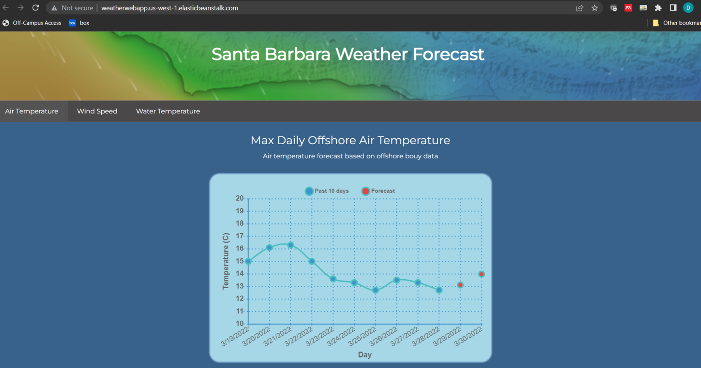
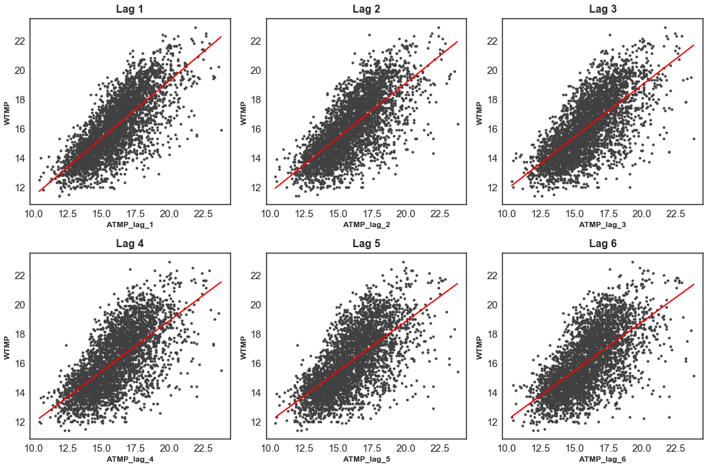
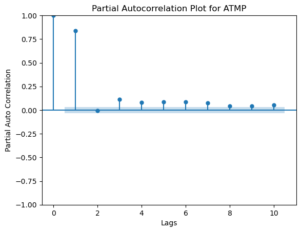
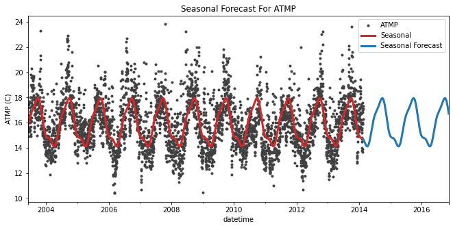
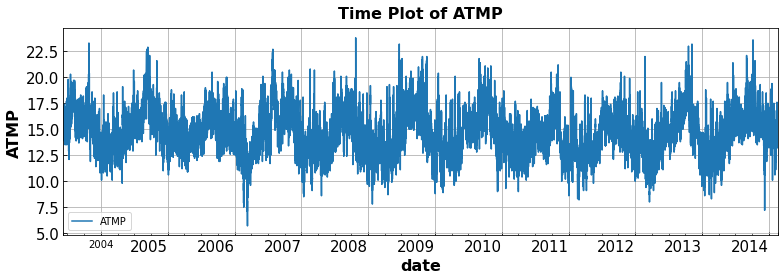
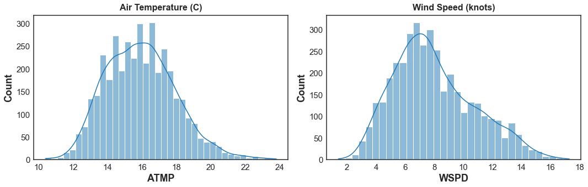
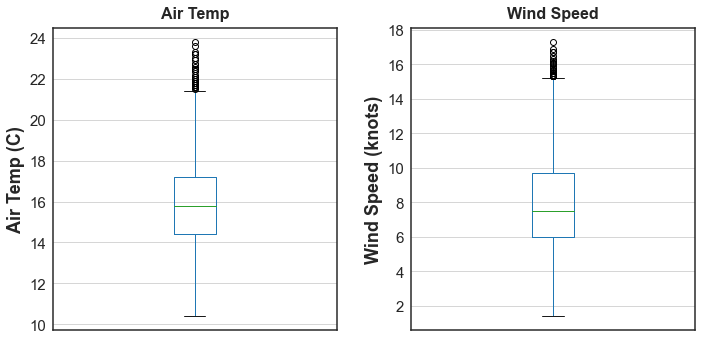
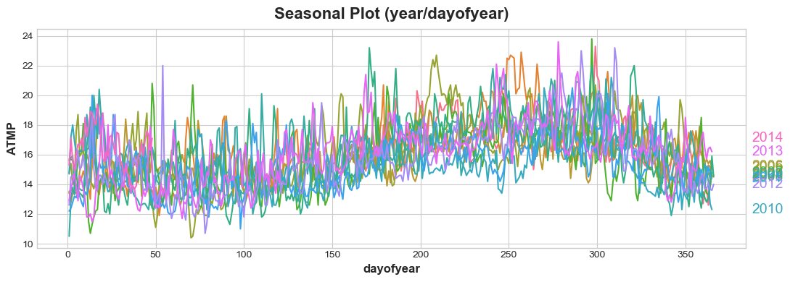

# Live Weather Forecaster Santa Barbara

  

### Web App Link: http://weatherwebapp.us-west-1.elasticbeanstalk.com/

## Overview
* Scraped live and historical timeseries weather data from NOAA bouy stations
* Feature engineering: lag features, fourier features, seasonal indicators, feature scaling
* Built a boosted hybrid model with a linear model (fourier features) and an XGboost model with lag features
* Deployed model in a full stack weather forecasting app on AWS

## Resources
**Python version:** 3.8

**Packages:** sqlite3, pandas, numpy, sklearn, XGBoost, seaborn, requests, flask, pickle

**Languages:** python, MYSQL, AWS, EB, amazon RDS, SQLite, JavaScript, HTML, CSS

## Web Scraping
* Built a live webscraper to scrape both historical data and realtime weather data from NOAA bouys
* Stored raw data in SQLite database

## Data Cleaning and Feature Engineering
* Identified gaps in data and streaks of sequential NaNs
* Imputed missing data from nearby weather stations
* Analyzed correlation and parcor between the target and lag features
* Resampled the data from hourly to daily frequency

  
  

  

## Exploratory Data Analysis
Used periodogram and seosonal plots to analyze the seasonality of the timeseries data and guide selection of fourier features

  

  

  

  

  

  
## Model Development
* I split the data into train and test sets (20% test) with the air temp as the target variable
* Built a boosted hybrid model 
  * Linear model to predict seasonality using fourier features 
  * XGB model to predict residuals using lag features
  
## Model performance
The Boosted Hybrid model achieved a 1-day forecast MAE of 0.9 C and a two day forecast MAE of 1.1 C

## Model Productionalization

  

* Created flask API endpoint 
* Wrote a full stack web application in HTML, CSS, and JavaScript which calls the flask API, and displays the max daily air temp over the past 10 days and the forecasted air temp using chart.js
* Hosted the web application on AWS EB: http://weatherwebapp.us-west-1.elasticbeanstalk.com/

## Future work
* Working on improving documentation
* Improved error handling in the web app and the API
* Working on adding LSTM model for wind speed prediciton
